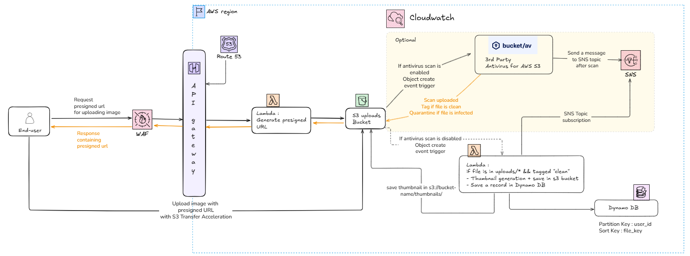

# File uploader infrastructure - managed with Terraform on AWS

## Overview

This project provides a **Terraform module** that allows clients to upload files securely to AWS.
It supports **optional malware scanning via BucketAV**, thumbnail generation, and user metadata storage in DynamoDB.
This infrastrcture is a **100% serveless**.

**Flow overview:**

1. Client requests a presigned URL from an API exposed via **API Gateway**.
2. Client **uploads the file directly to S3** using the presigned URL.
3. If **BucketAV** is enabled:
   - The upload triggers a scan.
   - BucketAV publishes results to an SNS topic.
   - Lambda subscribed to the topic generates thumbnails and saves metadata in DynamoDB.
4. If BucketAV is **disabled**:
   - Lambda is triggered directly by the **S3 object creation notification**.
5. Thumbnail is stored in a dedicated S3 folder `thumbnails/`, and metadata (file key, thumbnail key, user ID, etc.) is recorded in **DynamoDB**.




## Usage

Use in a terraform project by importing the module:

```text
module "file_uploader" {
  source = "git::https://github.com/lrasata/infra-file-uploader.git//modules/file_uploader?ref=v1.0.0"

  region                                        = var.region
  environment                                   = var.environment
  api_file_upload_domain_name                  = var.api_file_upload_domain_name
  backend_certificate_arn                       = var.backend_certificate_arn
  uploads_bucket_name                           = var.uploads_bucket_name
  enable_transfer_acceleration                  = var.enable_transfer_acceleration
  lambda_upload_presigned_url_expiration_time_s = var.lambda_upload_presigned_url_expiration_time_s
  use_bucketav                                  = var.use_bucketav
  bucketav_sns_findings_topic_name              = var.bucketav_sns_findings_topic_name
}
```
>
> **Prerequisites** to successfully deploy this infrastructure, are described in the Prerequisites section of [DEVELOPMENT.md](DEVELOPMENT.md)
>

### Access object in S3 private uploads bucket

This section only describes a suggestion/recommendation. But how you decide to access S3 private uploads bucket depends on your project requirements.

One way to securely serve files from a private S3 bucket is through **CloudFront distribution with Origin Access Control (OAC) + bucket policy**. This way, the bucket stays **private**, and only **CloudFront** can access it. End-users get **signed URLs** or **signed cookies** to access objects within the private S§ bucket.

The following outputs are provided by the module to allow a set up with Cloudfront distribution.

````text
output "uploads_bucket_id" {
  description = "The S3 uploads bucket ID (name)"
  value       = aws_s3_bucket.s3_bucket_uploads.id
}

output "uploads_bucket_arn" {
  description = "The ARN of the S3 uploads bucket"
  value       = aws_s3_bucket.s3_bucket_uploads.arn
}

output "uploads_bucket_regional_domain_name" {
  description = "The regional domain name of the S3 bucket (for CloudFront origin)"
  value       = aws_s3_bucket.s3_bucket_uploads.bucket_regional_domain_name
}

Usage : 
origin_bucket_arn = module.file_uploader.uploads_bucket_arn
````

> FYI: Currently testing the integration of `file-uploader` within the infrascture of a full-stack web application: [trip-planner-web-app](https://github.com/lrasata/infra-trip-planner-webapp)

## Key attributes

### Security

- Optional **BucketAV integration** to scan for malware before files are processed.
  - BucketAV scan is triggered after each upload and by default it deletes any infected file. (This behaviour can be changed in BucketAV settings)
- All files are stored in **S3 with default encryption SSE-S3**  at rest.
- **Public access blocked** on the S3 uploads bucket to prevent unauthorized access.
- **WAF** is attached to API Gateway to filter out bad traffic (bots, throttling, sql injection, etc.). It also blocks any unauthorised requests which do not contain required auth header.

### Reliability

- Lambda ensures **automatic scaling and high availability**.
- S3 provides effective unlimited storage.
  - Maximum object size: 5 TB per object.
  - Maximum number of objects per bucket: unlimited.
- SNS delivery ensures Lambda processing occurs only after BucketAV scan completes. **Lambda only process files which are tagged "clean" by BucketAV.**

### Scalability

- Lambda scales automatically with incoming SNS messages or S3 events.
- Optional **S3 Transfer Acceleration** provides global upload speed improvements.

### Maintainability

- **This Terraform project is built as a module**, it makes it easy to reuse across projects and environments.
- **Environment-specific variables** allow dev/staging/prod separation.
- Lambda functions are decoupled from S3 and SNS triggers, making updates safe and predictable.

## Infrastructure choices

### Why use DynamoDB instead of RDS

Using S3 for file storage is a standard practice, but for metadata storage we chose DynamoDB over a relational database (RDS).

- **Serverless alignment**: DynamoDB integrates naturally with the rest of the serverless stack (S3 + Lambda + API Gateway), ensuring consistent scalability and availability without managing servers.
- **Scalability & performance**: DynamoDB scales automatically with unpredictable upload traffic, delivering single-digit millisecond latency for lookups.
- **Fit for the use case**: The file uploader only requires simple, fast lookups (e.g., get file key or thumbnail URL by user). This doesn’t require complex relational queries, making DynamoDB the most efficient choice.

### Why BucketAV (or other proprietary AV) instead of using ClamAV (open-source) in Lambda

**TL;DR** For enterprise-grade, scalable, and low-maintenance infrastructure, a managed AV solution such as BucketAV is the pragmatic choice. While it reduces engineering overhead, it comes at [a cost](https://bucketav.com/pricing/) but it often proves cheaper in the long run when factoring in DevOps time, maintenance, and risk.

**Key considerations:**

- **Operational simplicity:** BucketAV abstracts away the AV infrastructure and is delivered as a ready-to-use CloudFormation stack with configurable options.
- **Maintenance burden:** Running ClamAV inside Lambda requires building and maintaining a Lambda Layer with ClamAV binaries and virus definitions. Building that layer (from experience) is painful and comes with challenges:
  - Lambda layer size limit (250 MB uncompressed) can easily be exceeded by ClamAV signatures.
  - Requires cross-compiling ClamAV for Amazon Linux 2.
  - Virus definitions must be constantly updated, requiring rebuilds and redeployments.
  
With BucketAV (or equivalent managed AV), patching, signature updates, and scaling are handled by the vendor.

- **Enterprise features:** Managed solutions like BucketAV provide features out of the box:
  - Quarantine buckets for infected files
  - Integration with SNS (used here to trigger downstream Lambda only after a file is marked “clean”)
  - Logging, monitoring, and compliance reporting